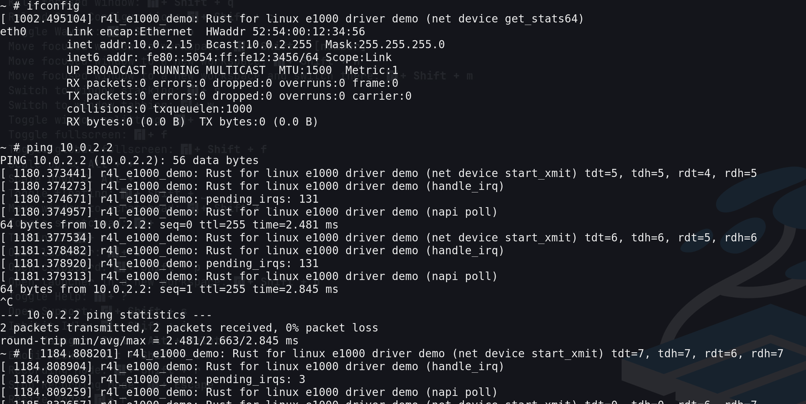
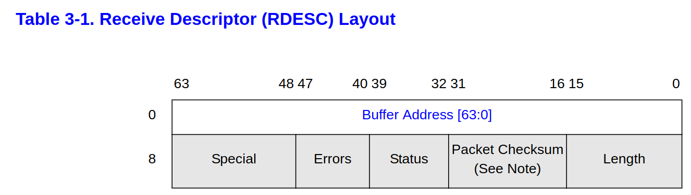
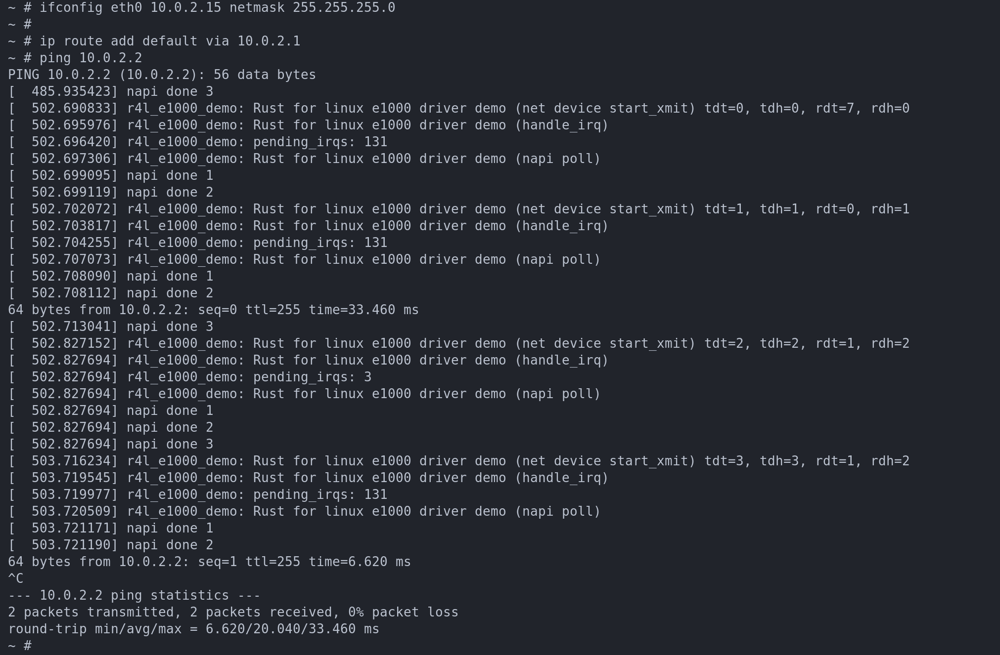
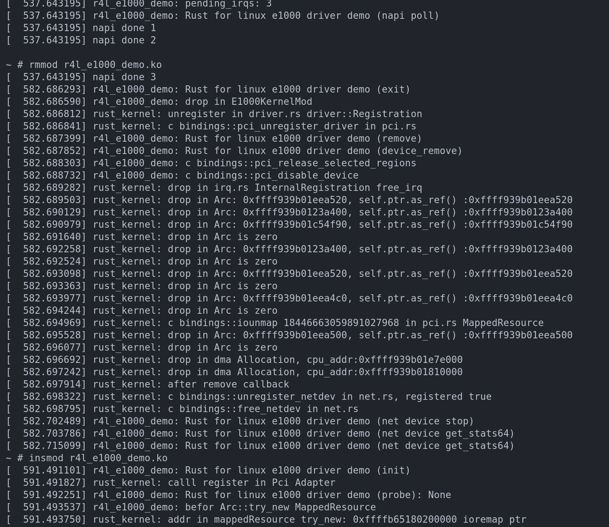
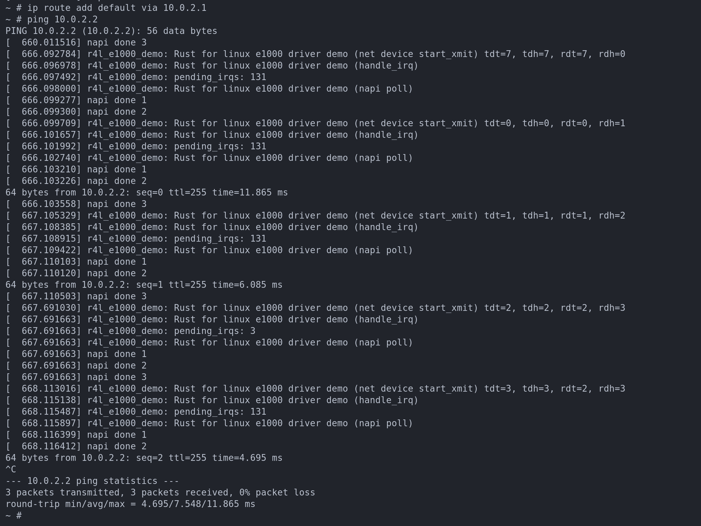
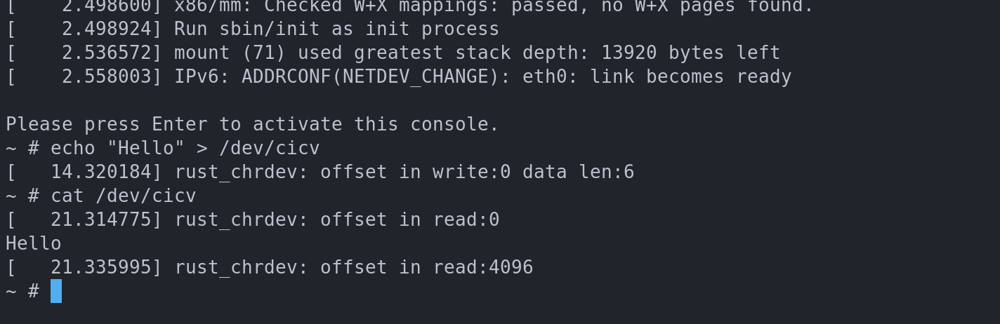

# Table of Contents

1.  [rust 4 linux](#orgfd25aa5)
2.  [e1000](#orga272ad0)
    1.  [相关资料](#org7616efc)
3.  [rust 4 linux 作业](#orgdc440bf)
    1.  [编译linux内核](#org7208c0c)
    2.  [作业2 编译srce1000](#org138c47f)
        1.  [1.编译成模块是在哪个文件哪条语句定义的？](#org0ddc31e)
        2.  [2.out-of-tree module怎么与内核产生关联?](#orgdbbc6cc)
        3.  [3.rust版本网卡驱动](#org7ac5084)
    3.  [作业3 编写简单rust模块](#org7abb8b2)
    4.  [作业4 为e1000添加remove](#org5e5f615)
        1.  [学习记录](#org305869a)
            1.  [RxDesc (Receive Descriptor)](#org356ae1f)
            2.  [c](#org0557ed5)
            3.  [e1000driver](#org2874474)
            4.  [rust](#orge427124)
            5.  [语法方面的学习](#orgf4511ef)
            6.  [pci.rs](#org3646f16)
            7.  [注册prob,remove](#orgca86048)
            8.  [remove 流程](#orgedb1fb8)
            9.  [mis](#org728266c)
            10. [rust 知识](#orgced6e11)
        2.  [作业结果](#orge172203)
            1.  [insmode ping](#orge004784)
            2.  [rmmode insmod ping](#org2183ccd)
            3.  [尚未完善的地方](#org36fcf8e)
    5.  [字符设备](#org7cb99f5)

[rustforlinux](../20240325215107-rust_for_linux.md)

# rust 4 linux

# e1000

<https://docs.qq.com/doc/DSk5xTHRJY1FZVUdK>

## 相关资料

<https://pdos.csail.mit.edu/6.828/2011/readings/hardware/8254x_GBe_SDM.pdf>

<https://docs.kernel.org/core-api/dma-api-howto.html>

# rust 4 linux 作业

## 编译linux内核

    make x86_64_defconfig
    make LLVM=1 menuconfig
    #set the following config to yes
    #General setup
    #        ---> [*] Rust support
    make LLVM=1 -j$(nproc)

menuconfig设置添加rust支持之后，.config文件

    ...
    
    CONFIG_RUST=y
    CONFIG_RUSTC_VERSION_TEXT="rustc 1.62.0 (a8314ef7d 2022-06-27)"
    CONFIG_BINDGEN_VERSION_TEXT="bindgen 0.56.0"
    CONFIG_TRACEPOINTS=y
    # end of General setup
    
    
    ...

## 作业2 编译srce1000

### 1.编译成模块是在哪个文件哪条语句定义的？

kbuild文件里面的
obj-m := r4le1000demo.o

> m指的是module

### 2.out-of-tree module怎么与内核产生关联?

在Makefile中的 ../linux 指的是内核路径

### 3.rust版本网卡驱动

    insmod r4l_e1000_demo.ko
    ip link set eth0 up
    # 这里提示参数无效, 用的替代命令 ifconfig eth0 10.0.2.15 netmask 255.255.255.0
    # ip addr add broadcast 10.0.2.255 dev eth0
    # ip addr add 10.0.2.15/255.255.255.0 dev eth0
    ifconfig eth0 10.0.2.15 netmask 255.255.255.0
    
    ip route add default via 10.0.2.1
    ping 10.0.2.2

    
    ip link set eth0 up
    ifconfig eth0 10.0.2.15 netmask 255.255.255.0
    ip route add default via 10.0.2.1
    ping 10.0.2.2

## 作业3 编写简单rust模块

修改的文件

    diff --git a/linux/samples/rust/Kconfig b/linux/samples/rust/Kconfig
    index 189c10ced..6fab6b309 100644
    --- a/linux/samples/rust/Kconfig
    +++ b/linux/samples/rust/Kconfig
    @@ -163,4 +163,12 @@ config SAMPLE_RUST_SELFTESTS
    
     	  If unsure, say N.
    
    +config SAMPLE_RUST_HELLOWORLD
    +	tristate "Hello world"
    +	help
    +	  This option builds the Rust helloworld sample.
    +
    +	  If unsure, say N.
    +
    +
     endif # SAMPLES_RUST
    diff --git a/linux/samples/rust/Makefile b/linux/samples/rust/Makefile
    index 420bcefeb..968d7f8af 100644
    --- a/linux/samples/rust/Makefile
    +++ b/linux/samples/rust/Makefile
    @@ -16,4 +16,7 @@ obj-$(CONFIG_SAMPLE_RUST_ECHO_SERVER)		+= rust_echo_server.o
     obj-$(CONFIG_SAMPLE_RUST_FS)			+= rust_fs.o
     obj-$(CONFIG_SAMPLE_RUST_SELFTESTS)		+= rust_selftests.o
    
    +
    +obj-$(CONFIG_SAMPLE_RUST_HELLOWORLD)		+= rust_helloworld.o
    +
     subdir-$(CONFIG_SAMPLE_RUST_HOSTPROGS)		+= hostprogs

## 作业4 为e1000添加remove

### 学习记录

#### RxDesc (Receive Descriptor)

对应的rust代码

    // Defined in intel chip manual section 3.2.3
    #[repr(C)]
    pub(crate) struct RxDescEntry {
        pub(crate) buf_addr: u64,
        pub(crate) length: u16,
        pub(crate) checksum: u16,
        pub(crate) status: u8,
        pub(crate) errors: u8,
        pub(crate) special: u16,
    }

#### c

#### e1000driver

    
    static struct pci_driver e1000_driver = {
    	.name     = e1000_driver_name,
    	.id_table = e1000_pci_tbl,
    	.probe    = e1000_probe,
    	.remove   = e1000_remove,
    	.driver = {
    		.pm = &e1000_pm_ops,
    	},
    	.shutdown = e1000_shutdown,
    	.err_handler = &e1000_err_handler
    };

#### rust

#### 语法方面的学习

1.  [raw pointer to ref](2024-04-07.md)

    net.rs
    
        pub(crate) unsafe fn from_ptr<'a>(ptr: *const bindings::net_device) -> &'a Device {
            // SAFETY: The safety requirements guarantee the validity of the dereference, while the
            // `Device` type being transparent makes the cast ok.
            unsafe { &*ptr.cast() }
        }
    
    `unsafe { &*ptr.cast() }`
    
    实际的调用顺序，
    ptr.cast() -> \*(ptr.cast()) -> &(ptr.cast())

2.  泛型,泛型内的数据类型作为泛型

    linux/rust/kernel/driver.rs
    
        
        /// The registration of a driver.
        pub struct Registration<T: DriverOps> {
            is_registered: bool,
            concrete_reg: UnsafeCell<T::RegType>,
        }
    
    `pub struct Registration<T: DriverOps>`
    这里的 `T: DriverOps` 指的是类型
    对比下面的 `concrete_reg: UnsafeCell<T::RegType>,` T::RegType 指的是类型T中的 `数据类型`
    注意下面的有2个冒号

3.  rust cell

    <https://www.youtube.com/watch?v=8O0Nt9qY_vo&ab_channel=JonGjengset>
    
    <https://rustwiki.org/zh-CN/std/cell/struct.Cell.html>
    
    1.  通过共享引用来改变值
    
        let num = Cell<i32>::new(32);
        num.set(10);
    
    1.  get返回的是copy
    
    <https://rustwiki.org/zh-CN/std/cell/struct.Cell.html#method.get>
    
    1.  cell没有相关方法来获取内部数据的ref
        永远无法获取内部数据的指针
    
    如果获取不到Cell里面T的引用，那么改Cell就是安全的，如果没人在引用里面的数据，那么改这个数据就行了
    
    > if we know no one else is a pointer to the value we&rsquo;re storing,
    > then changing that value is fine

4.  PointerWrapper

    暂时理解为，可以返回一个对\*const cvoid的引用
    比如下面的 `let data = unsafe { T::Data::borrow(bindings::dev_get_drvdata(&mut (*netdev).dev)) };`
    `bindings::dev_get_drvdata(&mut (*netdev).dev))` ffi调用返回的是c语言的指针
    这里可以把这个指针转换成rust中的某个数据的引用，那么这个引用的生命周期长度暂时理解为与c语言具体指针生命周期相关
    
        linux/rust/kernel/types.rs
        pub trait PointerWrapper {
            type Borrowed<'a>;
        
            fn into_pointer(self) -> *const c_void;
            unsafe fn from_pointer(ptr: *const c_void) -> Self;
            unsafe fn borrow<'a>(ptr: *const c_void) -> Self::Borrowed<'a>;
        }
        
        linux/rust/kernel/net.rs
        /// Corresponds to the kernel's `struct net_device_ops`.
        #[vtable]
        pub trait DeviceOperations {
            /// The pointer type that will be used to hold driver-defined data type.
            type Data: PointerWrapper + Send + Sync = ();
        
            /// Corresponds to `ndo_open` in `struct net_device_ops`.
            fn open(dev: &Device, data: <Self::Data as PointerWrapper>::Borrowed<'_>) -> Result;
        }
        
        
        impl<T: DeviceOperations> Registration<T> {
        
            unsafe extern "C" fn open_callback(netdev: *mut bindings::net_device) -> core::ffi::c_int {
                from_kernel_result! {
                    // SAFETY: The C API guarantees that `net_device` isn't released while this function is running.
                    let dev = unsafe { Device::from_ptr(netdev) };
                    // SAFETY: The value stored as driver data was returned by `into_pointer` during registration.
                    let data = unsafe { T::Data::borrow(bindings::dev_get_drvdata(&mut (*netdev).dev)) };
                    T::open(dev, data)?;
                    Ok(0)
                }
            }
        }
        
        _src_e1000/r4l_e1000_demo.rs
        #[vtable]
        impl net::DeviceOperations for NetDevice {
        
            type Data = Box<NetDevicePrvData>;
            /// this method will be called when you type `ip link set eth0 up` in your shell.
            fn open(dev: &net::Device, data: &NetDevicePrvData) -> Result {}
        }
    
    1.  TODO 待解决
    
        1.  看看理解的有没有问题

5.  解引用强制转换

    <https://rustwiki.org/zh-CN/book/ch15-02-deref.html>

#### pci.rs

    pub struct Adapter<T: Driver>(T);
    
    impl<T: Driver> driver::DriverOps for Adapter<T> {}

#### 注册prob,remove

    impl<T: Driver> driver::DriverOps for Adapter<T> {
        type RegType = bindings::pci_driver;
    
        unsafe fn register(
           ...
        ) -> Result {
            ...
               
            pdrv.name = name.as_char_ptr();
            pdrv.probe = Some(Self::probe_callback);
            pdrv.remove = Some(Self::remove_callback);
            pdrv.id_table = T::ID_TABLE.as_ref();
        }
    }

#### remove 流程

    
    static void e1000_remove(struct pci_dev *pdev)
    {
    	struct net_device *netdev = pci_get_drvdata(pdev);
    	struct e1000_adapter *adapter = netdev_priv(netdev);
    	struct e1000_hw *hw = &adapter->hw;
    	bool disable_dev;
    
    	e1000_down_and_stop(adapter);
    	e1000_release_manageability(adapter);
    
    	unregister_netdev(netdev);
    
    	e1000_phy_hw_reset(hw);
    
    	kfree(adapter->tx_ring);
    	kfree(adapter->rx_ring);
    
    	if (hw->mac_type == e1000_ce4100)
    		iounmap(hw->ce4100_gbe_mdio_base_virt);
    	iounmap(hw->hw_addr);
    	if (hw->flash_address)
    		iounmap(hw->flash_address);
    	pci_release_selected_regions(pdev, adapter->bars);
    
    	disable_dev = !test_and_set_bit(__E1000_DISABLED, &adapter->flags);
    	free_netdev(netdev);
    
    	if (disable_dev)
    		pci_disable_device(pdev);
    }

c的 `unregister_netdev` 在 `drop` net::Registration时调用

    impl<T: DeviceOperations> Drop for net::Registration<T> {
        fn drop(&mut self) {
            // SAFETY: `dev` was allocated during initialization and guaranteed to be valid.
            unsafe {
                if self.registered {
                    bindings::unregister_netdev(self.dev);
                }
                bindings::free_netdev(self.dev);
            }
        }
    }

什么时候 `net::Registration<DeviceOperations>` 失效的
prob的时候，放到了 `E1000DrvPrvData` 里面去

    
    let data = T::probe(&mut dev, info)?;
    // SAFETY: `pdev` is guaranteed to be a valid, non-null pointer.
    unsafe { bindings::pci_set_drvdata(pdev, data.into_pointer() as _) };

1.  从pci.rs removecallback开始
    
        impl<T: Driver> Adapter<T> {
            extern "C" fn remove_callback(pdev: *mut bindings::pci_dev) {
                //...
                T::remove(&data);
                <T::Data as driver::DeviceRemoval>::device_remove(&data);
            }
        }

2.  \_srce1000/r4le1000demo.rs
    
        impl pci::Driver for E1000Drv {
            // The Box type has implemented PointerWrapper trait.
            type Data = Box<E1000DrvPrvData>;
        
            fn remove(data: &Self::Data) {
                pr_info!("Rust for linux e1000 driver demo (remove)\n");
            }
        }
        
        impl driver::DeviceRemoval for E1000DrvPrvData {
            fn device_remove(&self) {
                pr_info!("Rust for linux e1000 driver demo (device_remove)\n");
        
            }
        }

#### mis

let reg = driver::Registration::<pci::Adapter<E1000Drv>>::newpinned(name, module)?

driver::Registration drop的时候，调用 DriverOps::unregister `bindings::pci_unregister_driver`

prob

    // net::Registration 保存了 pci_dev
    410 let mut netdev_reg = net::Registration::<NetDevice>::try_new(dev)?;

#### [rust 知识](2024-07-20.md)

### 作业结果

#### insmode ping

#### rmmode insmod ping

rmmode insmod

ping

#### 尚未完善的地方

freeirq的时候，没有检查是否在eth0 open的时候irq已经初始化了

## 字符设备

Q：作业5中的字符设备/dev/cicv是怎么创建的？它的设备号是多少？它是如何与我们写的字符设备驱动关联上的？

主设备号248 ， 次设备号0
代码中注册的时候，设置了次设备号为0

cat /proc/devices 可以发现
248 rustchrdev

> 
> 
> 在buildimage中用mknode创建的
> echo &ldquo;mknod /dev/cicv c 248 0&rdquo; >> etc/init.d/rcS

